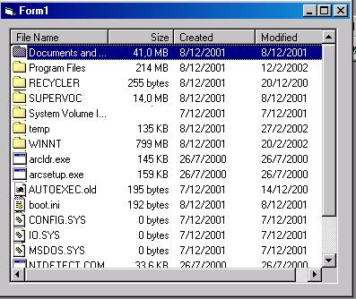



## Advanced ListView Control

### Description

This is an advanced ListView Control. It Populates a listview control using the

given path with the files and folders. The control retains most listview

properties, events and methods plus:

UserControl.Path (Read/Write) Property that specifies the path to populate

UserControl.Populate Method to populate the control

Feel free to enhance it!

Copyright © 2002 George Kontostanos
 
### More Info
 

             |
---                |---
**Submitted On**   |2002-02-27 19:38:04
**By**             |[George Kontostanos](https://github.com/Planet-Source-Code/PSCIndex/blob/master/ByAuthor/george-kontostanos.md)
**Level**          |Intermediate
**User Rating**    |4.6 (23 globes from 5 users)
**Compatibility**  |VB 6\.0, ASP \(Active Server Pages\) 
**Category**       |[Custom Controls/ Forms/  Menus](https://github.com/Planet-Source-Code/PSCIndex/blob/master/ByCategory/custom-controls-forms-menus__1-4.md)
**World**          |[Visual Basic](https://github.com/Planet-Source-Code/PSCIndex/blob/master/ByWorld/visual-basic.md)
**Archive File**   |[Advanced\_L580472272002\.zip](https://github.com/Planet-Source-Code/george-kontostanos-advanced-listview-control__1-32155/archive/master.zip)

